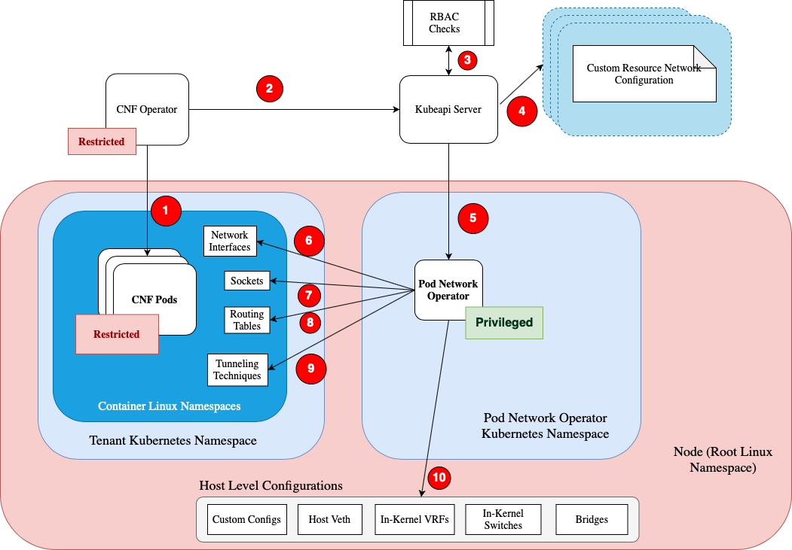
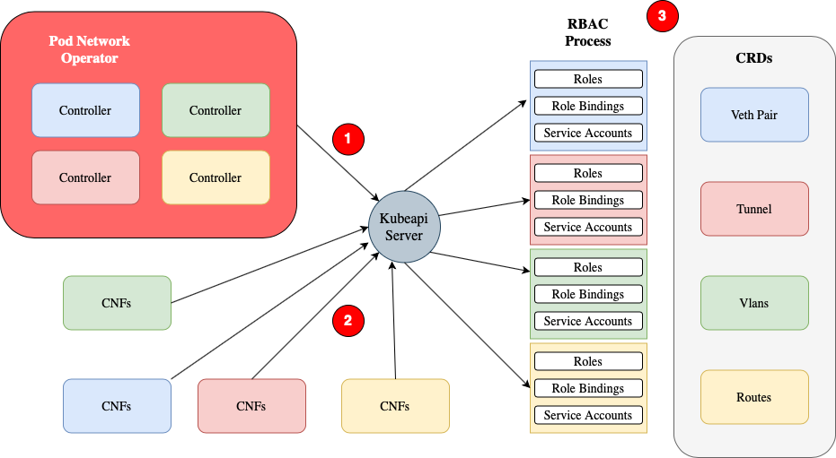
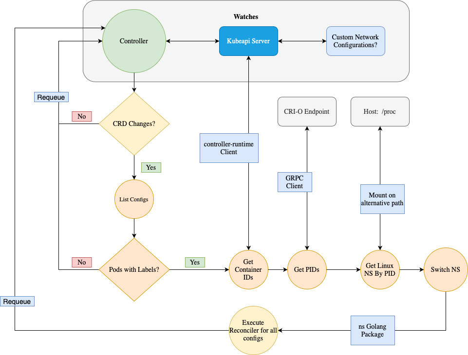

# Pod Network Operator
## Open Source Innovative Kubernetes Networking for Pods
---
### Abstract

Computing is being pushed to the edge, internet of things is becoming a reality and containerized multi-tenant platforms are the base for a hybrid cloud, multi-services, multi-partners serving the resources for those workloads. Services are a much stronger business drivers when they are packed together in a solid way in the same point of delivery or platform. Operators demonstrated their strength gaining immense space both on CNCF through the [Operator Framework](https://www.cncf.io/projects/) being accepted as an incubating project and growing number of operators on the operator hubs putting services side by side for kubernetes distributions. Finally the raise of 5G networks, an intricate technology connecting multiple of those layers together come to the table.

With those elements being painted on the scenario the need for more dynamic, flexible and intelligent networks capable of making changes or scheduling resources based on telemetry data becomes something real. Being able to create networks on the fly and delete them as a 5G call terminates, slice networks through multiple hops to separate traffic, classify packets and traffic and treat them accordingly, schedule resources according to network latency are some of the challenges that we aim to solve with this project.

The goal of the pod-network-operator is to experiment, try and test innovative and alternative ways to do networking, while maintaining compatibility with the the K8s constructs and network requirements (e.g. no NAT for pod-to-pod communication, etc).

#### Dynamic Network Use Case

IoT and Edge computing are changing the way we communicate, make business, travel, use our homes. Ultimately the way we live. The devices like smartphones, smart cars, multiple types of sensors used from industrial facilities to smart home appliances generate pretty different types of traffic.

So being able to allocate and remove networks dynamically, at runtime, on demand according to parameters such as bandwidth, latency, jitter effect, real time requirements, type of devices and orchestrating multiple of those networks across multiple layers on distributed topologies is the central point of our endeavor. Refining the requirements and experimenting with new solutions for dynamic intelligent networks is our common theme here.

#### Security Use Case as a Side Effect

<b>A Note on Linux Capabilities and Privilege Delegation</b>

CNF applications often need to deal with additional network configuration and usage in many different ways depending on the application and vendor. That almost always requires privileges on the network level. May it be a Linux capability like CAP_NET_ADMIN or even running some init container or sidecar container under the root user to perform configurations that the application wouldn't be able to do so without the privileges.

When we step in the multi-tenant platforms domain, the privileges associated with those applications are completely undesired and often questioned if they shouldn't be removed from those applications. That brings us to the second key point on the pod-network-operator strategy: abstracting the need for privileges by hiding any implementation details from the end user.

When configuring additional networks with special purposes with an specific feature in mind it often DOESN'T suffice to perform one task alone. It's necessary to run multiple tasks from interface creation, configuration and connection to routing rules or vlan tagging for example. That set of tasks may require CAP_NET_ADMIN, CAP_NET_BIND and CAP_NET_RAW together to be able to accomplish a single goal given that each capability will have its own set of possible privileged tasks for example. Those often need to be combined together to achieve the results required by the business.

Our primary goal is <b>NOT</b> to delegate any specific Linux capability privilege to an operator or mapping specific implementation tasks or set of tasks to an API in order to delegate privileges. Instead simple abstracted APIs hiding implementation details should be the way to go as we are looking for business needs that can be solved for the broader community. Understanding the actual missing features behind the privileges and capabilities, offering a clean, solid and long living solution on behalf of the whole community is key here. So the goal is abstracting implementation details while allowing for multiple possible implementations for the same abstraction. And with that solve the need for privileges as a side effect. In other words it's <b>NOT</b> about automating Linux security features but enabling businesses to have faster, dynamic and more intelligent networking on Kubernetes that can be easily configured and used without elevated privileges.

A few sections below we have a very good example of what we're talking about: <I>Kubernetes Network Profiles</I>.

That said, in order to make networking configurations on behalf of an arbitrary pod some privileges are required to be used by the pod-network-operator. Those privileges are needed for both pod and host level configurations. Host level configurations required to complete connectivity to, from or between pods will always demand privileged actions even with Linux user namespaces landing on Kubernetes or using different container technologies such as Kata Containers. That puts pod-network-operator on the category of a trusted privileged platform service for all tenants.

### Scope

Given the goals we have we need to delimit scope. The scope of this project is network configuration and tuning at the pod level specially designed with CNF multi-tenant environments in mind. For that to be accomplished any <b>host level</b> configuration will be performed on behalf of the pods where it makes sense without disrupting the main CNI plugin used by the cluster, the main routing table on the host and the rules published on iptables by the current kube-proxy workload or other CNI related pieces of software. This behavior on the host of not overriding anything created by the main CNI plugin may be changed as an optional feature but not a default one for the moment.

#### That said What this operator is not:

This operator is NOT intended to configure anything cluster wide that affects all pods or an entire node behavior with that intent. Those tasks are already performed by a set of operators such as the ones below, but not limited to them:

- `Machine Config Operator` - https://github.com/openshift/machine-config-operator
- `Performance Addons Operator` - https://github.com/openshift-kni/performance-addon-operators
- `Cluster Node Tuning Operator` - https://github.com/openshift/cluster-node-tuning-operator
- `Special Resource Operator` - https://github.com/openshift-psap/special-resource-operator
- `Node Feature Discovery Operator` - https://github.com/openshift/cluster-nfd-operator

This operator is also NOT intended to own specific application deployments, daemonsets, statefulsets or any other application workloads that may result in pods or replicas. It SHOULD own only the configurations it provides gracefully terminating them when a Pod terminates, when the identifying label is deleted or when an entire or partial network configuration object is deleted.

#### Road Map and Desired Features

    Kubernetes Network Profiles

    SRv6

    Service Chaining

    Containerized VRFs

    Dynamic Routing Protocols

    Containerized End to End Tunnels

#### Operator Architectural Design Proposal

#### Overview:

</img>

1. Ideally a CNF operator spins up pods to run CNF applications in the tenants namespace with the proper permissions and running with the restricted SCC. It could be deployed by helm or yaml manifests as well;
2. The CNF requires privileged pod network configurations. Those could be at initialization time or runtime. The operator or the application itself may request those configurations as part of the deployment using basic yaml manifests or dynamically at CNFs lifetime on demand according to its own conditions by sending an update or create request to the kubeapi-server with the network configuration CRD.
3. An admission process will take place and both authentication and authorization will be checked before granting any access to the that specific network configuration CRD;
4. After authorizing, the kubeapi-server allows access to the network configuration;
5. Any configuration changes, creation or deletion will be watched and received by the pod network operator triggering the reconciler;
6. It may make any configuration on network interfaces provided by Linux or other available packages on behalf of the pod;
7. It may pass on sockets to the pods as needed without granting privileged access to that pod if it make sense to do so;
8. It may change routes in the pods context to complete its configuration if needed;
9. Any kind of tunneling techniques available on Linux and other possible custom packages may be used to build on demand tunnels and connect the CNF pod with other workloads.
10. All those possible configurations will be completed with whatever is needed at host level as long as it doesn't disrupt the CNI plugin being used, the main host routing table, iptables and other main network stack components. Ideally all configurations will be using separate tables and configurations.

#### Fine Grained Permission Control

</img>

Every network configuration in the system will be available through an individual custom resource definition. That allows for fine grained RBAC rules to be implemented on top of them giving the administrators the freedom to grant or deny access to very specific actions on pod networking creating plenty of possibilities for multi-tenant environments setups.

1. The pod network operator may hold multiple controllers and have access to all CRDs in order to reconcile different networking configurations and components on multiple levels;

2. The CNF tenant will have only the permissions needed for the configuration subset it requires;

3. Each CRD as an API endpoint can be used as any other kubernetes object. They can be referenced in roles with the well known rules and verbs, combined with the proper role bindings having the proper service accounts as subjects.

The only caveat here is from the management perspective. A new CRD may be created to track down all the information from all the separate pieces of configuration into a single object for visibility and administration.

#### The Controller Workflow

</img>

The controller workflow represented in the diagram above shows simplified steps on how the reconciliation process occurs. A few steps before actually running the configuration functions it's necessary to find out what pods need new configurations, grab the first container ID from the Pod resource object and pass it as a parameter with a ContainerStatusRequest to CRI-O. From the ContainerStatusResponse we can get the process ID for that container. It's the same process that crictl inspect does.

Here we have an important observation. If the configuration is to be available to a Pod (a.k.a. shared linux namespaces between containers) then the first container ID is fine. If it's container or even process specific (for application with more than one process "inside" a container) then the procedure is a little bit more complex than the one represented on the diagram above.

After that we can read the correct path /proc/<PID>/ns/<desired namespace> that has a symbolic link with the namespace type and inode for the namespace we want to jump in from the operator. Then we use the ns package from github.com/containernetworking/plugins. Within the proper namespace all changes will affect the desired container or pod.

When it comes to the host it's the same process. We move to PID number 1 and the desired namespace and that's all.

For the reconciler function itself it will depend on the logic and configurations that we're trying to achieve. Each different configuration object may require different libraries to perform the configurations.

#### Contribution

Community meetings, slack channel and YouTube channel coming soon.