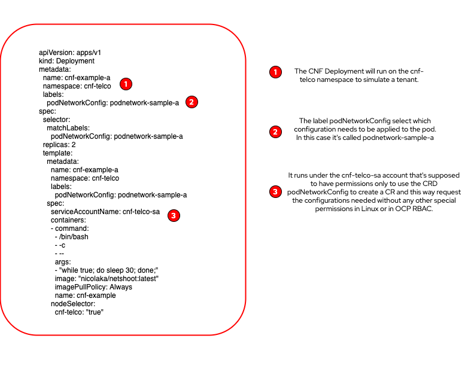

# Pod Network Operator

This project is an attempt to solve various CNF and Telco networking challenges that can't be addressed quickly by the upstream Kubernetes community and make it available in both OpenShift and Kubernetes.

---
#### Warning
> This is an in progress development. This operator is in its early stages and should not be used in production.
---

# Design Proposal

* [Design Proposal](docs/design_proposal.md)

Coming soon:
* [Considerations on Iptables and Other Data Plane Changes](docs/iptables.md)
* [Security Considerations](docs/security.md)
* [Why not a CNI plugin? CNI plugin and the Operator Compared](docs/cni_plugins.md)

---

## Installing the Operator Manually

Here you'll find the instructions to install the operator itself. That task should be performed by a cluster admin specially on a multi-tenant environment. The operator will be running on its own namespace and watching the tenant's namespace for networking configurations to be performed on their pods.

#### REQUIREMENTS:

- OpenShift cluster 4.6+
- GNU Make 3.8+
- oc
- go 1.15+

#### Steps to Install:

1 - Clone the project

`git clone https://github.com/opdev/pod-network-operator.git`

2 - Change to its directory `cd pod-network-operator`

3 - In this PoC phase the operator runs as a deployment in one specific node. (In the near future it will work as a Daemonset being deployed to all nodes) To make it work correctly with the samples, chose one worker node from your `oc get nodes` command and label it like below:

`oc label nodes < your node url/ip here > cnf-telco=true`

3 - Run `make deploy`


  The operator is configured to be installed in the pod-network-operator namespace. It will create the namespace and install all the RBAC necessary objects to make it work properly. Refer to the [security considerations section](docs/security.md) to understand all the implications of installing it and also all the RBAC elements such as the service account, roles, cluster roles, role bindings etc. Besides that this command will also install all the CRDs owned by the operator.

  After running the `make deploy` command you should see something like below:

```
$ make deploy 
/root/go/src/github.com/project/pod-network-operator/bin/controller-gen "crd:trivialVersions=true,preserveUnknownFields=false" rbac:roleName=manager-role webhook paths="./..." output:crd:artifacts:config=config/crd/bases
cd config/manager && /root/go/src/github.com/project/pod-network-operator/bin/kustomize edit set image controller=quay.io/opdev/pod-network-operator:0.0.1
/root/go/src/github.com/project/pod-network-operator/bin/kustomize build config/default | kubectl apply -f -
namespace/pod-network-operator created
customresourcedefinition.apiextensions.k8s.io/bridges.podnetwork.opdev.io created
customresourcedefinition.apiextensions.k8s.io/podnetworkconfigs.podnetwork.opdev.io created
serviceaccount/pod-network-operator-sa created
role.rbac.authorization.k8s.io/leader-election-role created
role.rbac.authorization.k8s.io/manager-role created
role.rbac.authorization.k8s.io/role-scc-privileged created
clusterrole.rbac.authorization.k8s.io/manager-role created
rolebinding.rbac.authorization.k8s.io/leader-election-rolebinding created
rolebinding.rbac.authorization.k8s.io/manager-rolebinding created
rolebinding.rbac.authorization.k8s.io/rolebinding-priv-scc-pod-network-operator created
clusterrolebinding.rbac.authorization.k8s.io/manager-rolebinding created
configmap/manager-config created
deployment.apps/pod-network-operator created

```
4 - Finally when running the `oc get pods -n pod-network-operator` you should see something like below:

```
NAME                                    READY   STATUS    RESTARTS   AGE
pod-network-operator-7c9bd6dbb8-cqtj9   1/1     Running   0          23m
```

At this point the operator will be watching the tenant target namespace. Now follow the tenant's instructions on how to request new network configurations for Pods.

## Running a Sample Deployment to Test the Operator

It's important to understand that this operator doesn't manage any Deployments, DeamonSets, StatefulSets or Pods for the tenant. It applies and reconciles new network configurations for them based on the labels applied on those resources.

Under config/samples/ we find deployment-a.yaml that look like this:

</img>


By running `oc apply -f config/samples/deployment-a.yaml` logged in as a cluster admin we can configure both the CNF deployment and its needed RBAC configurations just for the sake of testing.

For real use in production environments the RBAC configurations should be provided by the cluster admin and/or the Operator Lifecycle Manager and deployments and application can be created by the tenant.

The result of this sample is a couple of pods running in the cnf-telco namespace:

`oc get pods -n cnf-telco`

```
oc get pods -n cnf-telco
NAME                             READY   STATUS    RESTARTS   AGE
cnf-example-a-7cdb5b9fff-cr2pv   1/1     Running   0          44h
cnf-example-a-7cdb5b9fff-tjrkk   1/1     Running   0          44h
```

They will be used throughout multiple examples.

## Installing or Programatically Requesting New Network Configurations:

Bellow we can find a list of use cases. 

For each one added a documentation page will also be available.

- [Extra Configurations on the Primary Network provided by CNI Plugin](docs/mtu.md)
- Additional Networks at runtime
- Linux bridges
- Linux VLANs on Additional Networks
- Macvlans
- Tunnels